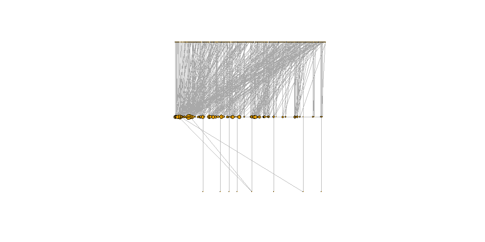

```r
selfCompare <- read_csv("./selfCompare.csv", show_col_types = FALSE) %>% 
  select(-c(gender)) %>% fill(season) %>%
  pivot_longer(3:9, values_to="inspiration") %>% select(-c(name)) %>%
  filter(!is.na(inspiration)) %>%
  separate(inspiration, into = c('inspFirst', 'inspLast'),
           sep=" ", extra="merge", remove=FALSE)
```

## Data Wrangling


```r
fullNames <- castaway_details %>% 
  merge((castaways %>% select(c(castaway_id, version_season))), 
        by="castaway_id") %>%
  mutate(full_name = case_when(
    castaway_id == "US0281" ~ "JT Thomas", 
    castaway_id == "US0029" ~ "Elisabeth Hasselbeck",
    TRUE ~ full_name)) %>%
  separate(full_name, into = c('first','last'), 
    sep = " ", extra = "merge", remove = FALSE) %>%
  mutate(name = case_when(
    str_detect(full_name,short_name) ~ str_c(first, ' ', last),
    TRUE ~ str_c(first, ' "', short_name, '" ', last))) %>%
  select(castaway_id, full_name, first, short_name, last) %>%
  merge((selfCompare %>% select(c(inspiration, inspFirst, inspLast))),
        by.x="last", by.y="inspLast", all=TRUE) %>% unique() %>%
  mutate(inspiration = case_when(
    !is.na(inspiration) ~ inspiration,
    str_detect(short_name, first) ~ full_name,
    short_name == last ~ full_name,
    castaway_id == "US0302" ~ full_name,
    castaway_id == "US0305" ~ "Jimmy Tarantino",
    TRUE ~ str_c(short_name, last, sep=" "))) %>%
  mutate(fullName = case_when(
    is.na(inspFirst) ~ inspiration,
    full_name == inspiration ~ full_name,
    short_name == inspFirst ~ inspiration,
    short_name == "Shan" ~ str_c(short_name, last, sep=" "),
    str_detect(full_name, short_name) ~ full_name,
    TRUE ~ str_c(short_name, last, sep=" "))) %>%
  rename(shortName = short_name) %>%
  left_join(castaways, by="castaway_id") %>% unique() %>%
  mutate(season = substr(version_season,3,4)) %>%
  select(season, castaway_id, first, shortName, last, fullName)

selfCompare <- selfCompare %>% select(-c(inspFirst, inspLast)) %>% 
  mutate(season = substr(season,8,9)) %>%
  left_join(fullNames,  by=c("season"="season", "castaway"="shortName")) %>%
  rename(cast_name = fullName, cast_id = castaway_id) %>%
  select(cast_id, cast_name, inspiration) %>%
  left_join(fullNames, by=c("inspiration"="fullName")) %>%
  rename(inspo_name = inspiration, inspo_id = castaway_id) %>%
  select(cast_id, cast_name, inspo_id, inspo_name) %>% unique()
```


```r
stats <- castaways %>% 
  select(version_season, castaway_id, full_name, day, order, jury_status) %>%
  group_by(version_season) %>% mutate(order = max(order) + 1 - order) %>%
  arrange(version_season, order) %>% mutate(day = case_when(
    !(version_season %in% c("US38", "US40")) ~ day,
    is.na(jury_status) ~ day, day >= 35 ~ day, TRUE ~ 35)) %>% ungroup() %>%
  select(-c(jury_status)) %>% group_by(version_season, castaway_id) %>% 
  mutate(order = case_when(n() > 1 ~ min(order), TRUE ~ order),
         day = case_when(n() > 1 ~ max(day), TRUE ~ day)) %>% unique() %>%
  ungroup() %>% group_by(version_season) %>% mutate(order = row_number()) %>%
  ungroup() %>% group_by(castaway_id) %>% 
  mutate(total_seasons=n(), total_days=sum(day), 
         best_place=min(order), avg_place=round(mean(order),2)) %>%
  ungroup() %>% select(-c(day, order, version_season))
  

# recency (last 5 seasons),
# number of inspirations, top 10 seasons, gender
# topSzns <- viewers %>% 
#   select(season, viewers, rating_18_49, share_18_49, imdb_rating)
```


```r
edges <- selfCompare %>% select(cast_id, inspo_id) %>%
  rename(from = cast_id, to = inspo_id)

nSize <- selfCompare %>% select(inspo_id, inspo_name) %>%
  group_by(inspo_id) %>% mutate(count = n()) %>%
  select(inspo_id, count) %>% unique() %>% filter(count > 1)

nodes <- selfCompare %>%
  pivot_longer(everything(), names_to= c("type", "name"), names_sep="_") %>%
  mutate(type = 1:(nrow(selfCompare)*4), type = case_when(
    type %% 2 == 0 ~ type / 2,
    TRUE ~ as.double(NA))) %>% fill(type, .direction="up") %>%
  pivot_wider(id_cols="type", names_from="name", values_from="value") %>%
  select(-c(type)) %>% unique() %>%
  left_join(nSize, by=c("id"="inspo_id")) %>%
  mutate(scaled = case_when(is.na(count) ~ 0.5, TRUE ~ as.double(count)),
         scaled = log(scaled+1)*2)
```

## Data Visualization


```r
net <- graph_from_data_frame(
  d = edges, vertices = nodes, directed = T
)
net <- igraph::simplify(
  net, remove.multiple=F, remove.loops=T
)
# layout_nicely(net), layout_with_dh(net), layout_with_gem(net),
# layout_with_graphopt(net), layout_with_kk(net), 
# layout_with_lgl(net), layout_with_mds(net)
plot(net, 
     edge.arrow.size=0, 
     edge.size=0.01,
     vertex.label=NA,
     vertex.size=V(net)$scaled,
     # vertex.size=3,
     layout=layout_as_tree(net))
```

<!-- -->
